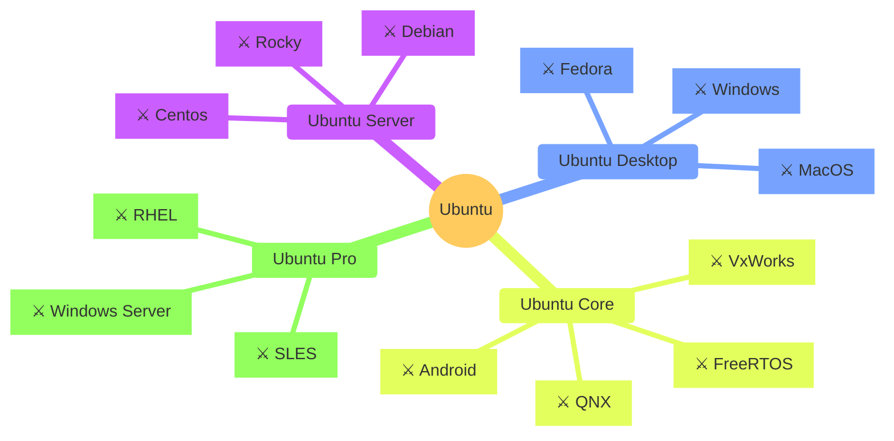

<link rel="stylesheet" href="path/to/font-awesome/css/font-awesome.min.css">

# Canonical Ecosystem Mindmaps

Here is a number of mindmaps describing Canonical competitive environment in 2024 around
different offerings.

## Ubuntu

